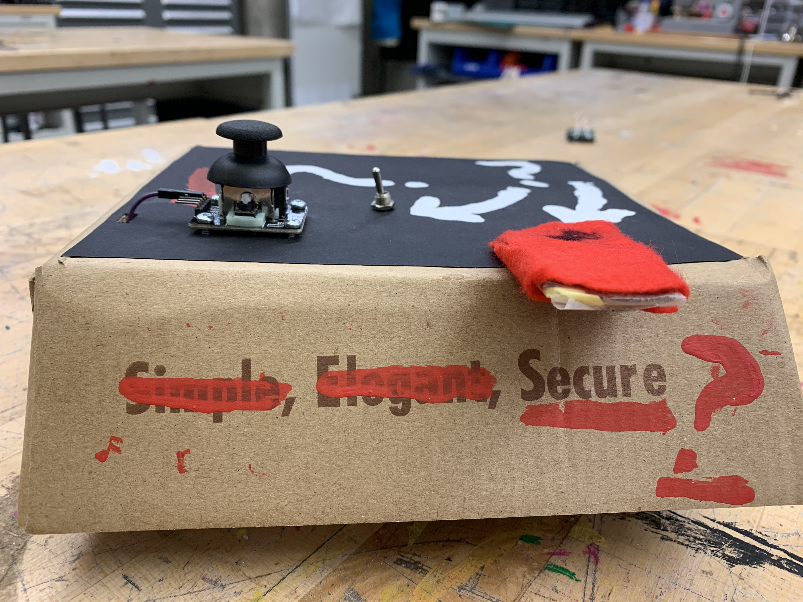
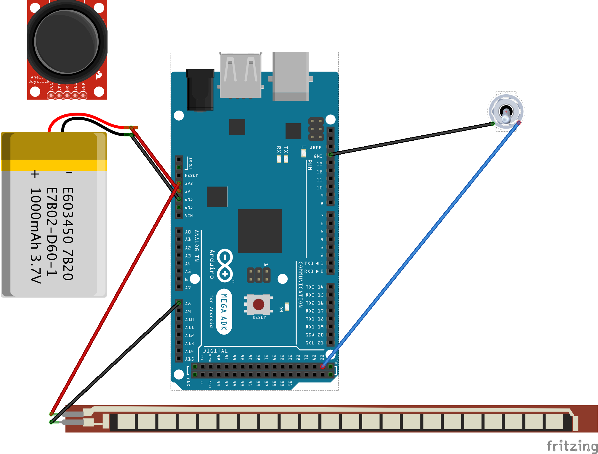
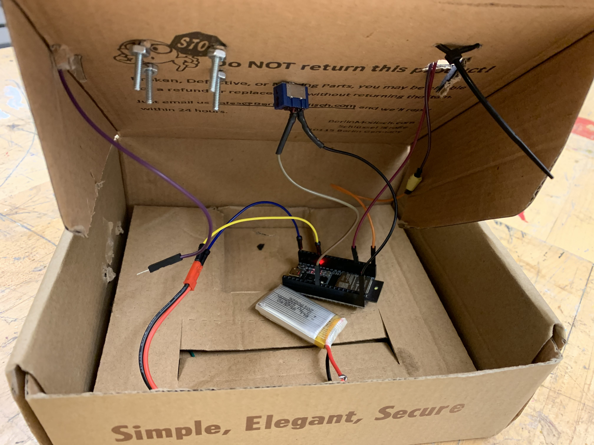
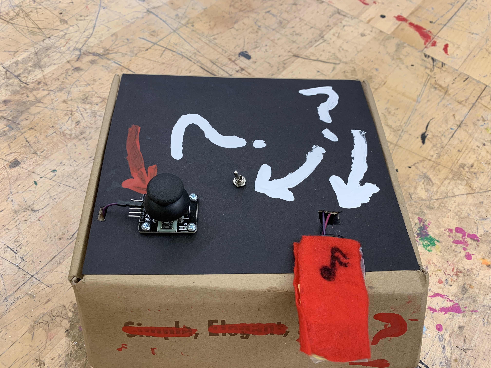

# The Mystery Music Box

Hi there! This is a (wireless) twist on my previous project, the Simple Music Box. While the Simple Music Box was geared towards delightfulness and ease of use for non-musicians, the Mystery Music Box aims to mislead, and maybe provide a bit of chaotic exploration! In the spirit of "unseen effect", I purposefully made the box a bit vague, even including a dummy switch (the joystick), which isn't even hooked up to anything! 

[A link the Mystery Music Box in action.](https://www.youtube.com/watch?v=5N2e5lZSK9Q)

## Setup

### Necessary Hardware
- Espressif ESP32 DevKitC
- Analog joystick 
- SPST switch (soldered)
- Breadboard
- A few various male/female wires
- LiPo battery
- Flex sensor ([I created mine from this tutorial.](https://www.instructables.com/id/DIY-Flex-Sensor-Under-1-/))

#### Hardware Setup

Here's a rough hookup guide, though I used an ESP32 and a homemade flex sesnor:

Here's a picture of the real set-up:

##### Analog Joystick
- Dummy sensor, not in use.

#### SPST Switch
- One tab wired to GND on breadboard, the other tab wired to the ESP32 I/O pin 17 (either directly or via another wire from the breadboard).

#### Flex Sensor (DIY)
- One tab wired to 3v3 on the ESP32, the other wired to the ESP32 I/O pin 34.

#### LiPo Battery
- GND connected to GND, power connected to the 5v pin on the ESP32.

### Software to Install

Luckily, (and ironically!) the Mystery Music Box is simpler, software-wise, than the Simple Music Box

#### Arduino 
I used the [Arduino IDE](https://www.arduino.cc/en/main/software) to flash the Espressif ESP32 DevKitC with the code here, under the `arduino` folder.

#### Sonic-Pi
A wonderful live-coding tool built for the Pi (though it doesn't need to be ran on the Pi). [Download here.](https://sonic-pi.net/)

#### Python-Sonic

An awesome tool that lets us communicate with Sonic-Pi via Python. [Download it here.](https://github.com/gkvoelkl/python-sonic) Alternatively, `pip install python-sonic` should do the trick.

### Running it
- After powering the ESP32, connect to its WiFi network. Example credentials given, but feel free to modify the name/password in the Arduino sketch.
  - Network: `ESP32_jcong`
  - Password: `spookyseason`
  
Enjoy!

- Launch `Sonic-Pi` on whatever machine you intend to use with the Mystery Music Box
- Navigate to this repository on the command line and enter `python3 player.py`
- Enjoy the mystery!
